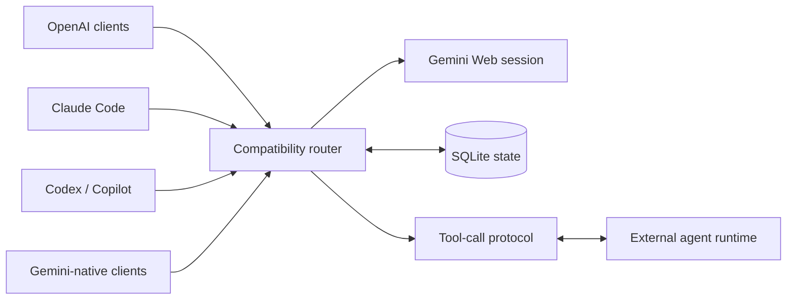

# gemini-web2api

<p align="center">
  
</p>

<p align="center">
  <strong>Turn Gemini Web into an Agent backend for Codex, Claude Code, and Copilot.</strong><br>
  An unofficial compatibility gateway for coding agents, chat UIs, SDKs, and Google-native clients.
</p>

<p align="center">
  <a href="https://github.com/ksda9001/gemini-web2api-plus/stargazers"></a>
  <a href="https://github.com/ksda9001/gemini-web2api-plus/network/members"></a>
  <a href="https://github.com/ksda9001/gemini-web2api-plus/blob/main/LICENSE"></a>
  
  
</p>

<p align="center"><a href="README_CN.md">中文文档</a></p>

> **Important:** This is an unofficial bridge to Gemini's web service, not an official Google API. It uses a browser session or anonymous web access, so upstream behavior, account access, and rate limits remain controlled by Google. Use it only with accounts and traffic you are authorized to use.

## Why this project?

Most Gemini web wrappers solve one problem: send text to Gemini. `gemini-web2api-plus` is an **Agent-first Gemini gateway**: one backend can serve Codex CLI, Claude Code, Copilot-style agents, chat UIs, OpenAI SDKs, and Google-native clients at the same time.

- **Drop-in API gateway** for OpenAI-compatible applications.
- **Agent-first compatibility** for Codex CLI, Claude Code, and Copilot-style clients, including real multi-step tool loops.
- **Streaming that survives long work**, with SSE heartbeats, retries, and automatic continuation for Gemini output-limit errors.
- **Conversation continuity**, using Gemini Web conversation metadata plus SQLite mappings for client histories and tool loops.
- **Optional authenticated Web sessions**, cookie refresh, proxies, API keys, and Docker persistence.
- **One small Python service**, with no database server or frontend required.

## Compatibility at a glance

| Client or integration | Endpoint | Supported behavior |
| --- | --- | --- |
| OpenWebUI, NewAPI, Cherry Studio, ChatBox | `/v1/chat/completions` | Chat, SSE streaming, function calling |
| Codex CLI | `/v1/responses` | Responses API, tool calls, `previous_response_id`, multi-step loops |
| Claude Code | `/v1/messages` | Anthropic Messages, streaming tool use, thinking blocks |
| Copilot-style agents | `/v1/chat/completions` | OpenAI-compatible tool loops |
| Gemini CLI and Google-native clients | `/v1beta/models/...` | `generateContent`, `streamGenerateContent`, function calls |
| OpenAI Python SDK | `/v1` | Chat Completions and streaming |

The server is the model gateway. It emits tool calls; the connected agent client executes those tools in its own real environment. The gateway never pretends that Gemini itself can access the client's filesystem or terminal.

## How the request flows



For a normal chat, the router sends a compact prompt to Gemini Web. For an agent request, it sends the task and declared tools, returns a protocol-native tool call, receives the external tool result, and continues the same Gemini Web conversation. SQLite stores the bridge between the client-visible history and Gemini's conversation metadata.

## Quick start

### Docker (recommended)

```bash
git clone https://github.com/ksda9001/gemini-web2api-plus.git
cd gemini-web2api-plus

cp config.example.json config.json
docker build -t gemini-web2api .

docker run -d \
  --name gemini-web2api \
  --restart unless-stopped \
  -p 8081:8081 \
  -v "$PWD/config.json:/app/config.json:ro" \
  -v gemini-web2api-data:/app/data \
  gemini-web2api
```

Check that the service is alive:

```bash
curl http://127.0.0.1:8081/
```

The persistent `/app/data` volume keeps SQLite state and derived cookie cache across container recreation. Do not put cookies or real API keys into the image.

### Python

```bash
git clone https://github.com/ksda9001/gemini-web2api-plus.git
cd gemini-web2api-plus

python -m venv .venv
# Linux/macOS:
source .venv/bin/activate
# Windows PowerShell: .venv\Scripts\Activate.ps1

python -m pip install -U pip
python -m pip install -r requirements.txt
cp config.example.json config.json
python -m gemini_web2api --config config.json
```

The default listener is `http://127.0.0.1:8081`. Use `--port`, `--proxy`, or `--cookie-file` for one-off overrides:

```bash
python -m gemini_web2api --config config.json --port 8081
python -m gemini_web2api --cookie-file ./cookie.json
python -m gemini_web2api --proxy http://127.0.0.1:7890
```

## First API call

With `api_keys: []`, authentication is disabled. If you configure one or more keys, `/v1/*` requests require a Bearer token or `x-api-key`.

```bash
curl http://127.0.0.1:8081/v1/chat/completions \
  -H 'Content-Type: application/json' \
  -H 'Authorization: Bearer sk-your-key' \
  -d '{
    "model": "gemini-3.5-flash",
    "messages": [{"role": "user", "content": "Hello from gemini-web2api"}]
  }'
```

OpenAI Python SDK:

```python
from openai import OpenAI

client = OpenAI(
    base_url="http://127.0.0.1:8081/v1",
    api_key="sk-your-key",
)

answer = client.chat.completions.create(
    model="gemini-3.5-flash-thinking",
    messages=[{"role": "user", "content": "Explain quantum computing simply."}],
)
print(answer.choices[0].message.content)
```

## Agent setup

Agent clients use different wire protocols. Point each client at the matching base URL and let the client keep driving the tool loop.

| Client | Base URL | Wire protocol |
| --- | --- | --- |
| Codex CLI | `http://127.0.0.1:8081/v1` | OpenAI Responses API |
| Claude Code | `http://127.0.0.1:8081` | Anthropic Messages API |
| Copilot or another OpenAI-compatible agent | `http://127.0.0.1:8081/v1` | Chat Completions |

### Codex CLI

Example provider configuration:

```toml
model_provider = "gemini-web2api"
model = "gemini-3.5-flash"

[model_providers.gemini-web2api]
name = "gemini-web2api"
base_url = "http://127.0.0.1:8081/v1"
wire_api = "responses"
env_key = "GEMINI_WEB2API_KEY"
requires_openai_auth = false
```

Set `GEMINI_WEB2API_KEY` to a value from `api_keys`, or use any placeholder when authentication is disabled.

### Claude Code

```bash
export ANTHROPIC_BASE_URL=http://127.0.0.1:8081
export ANTHROPIC_AUTH_TOKEN=sk-your-key
export ANTHROPIC_MODEL=gemini-3.5-flash
```

If Claude Code is routed through NewAPI, NewAPI may convert the request into Google-native `streamGenerateContent`. The gateway recognizes Claude, Codex, and Copilot agent markers in that converted system prompt and preserves the tool protocol for the round trip.

### Copilot-style clients

Choose an OpenAI-compatible provider and use:

```text
Base URL: http://127.0.0.1:8081/v1
Model:    gemini-3.5-flash
API key:  a configured api_keys value, or a placeholder when auth is disabled
```

The exact environment variables depend on the client or extension.

### What makes the agent loop persistent?

Agent behavior is deliberately split between the gateway and the external client:

1. The first tool turn sends the task, behavior instructions, and declared tools.
2. Gemini returns a native tool call through the client's protocol.
3. Codex, Claude Code, or Copilot executes the tool and sends back the result.
4. SQLite maps the tool call or message history to Gemini Web conversation metadata.
5. Later turns send only new user text and trusted tool results when the saved session can be resumed.

This avoids injecting a large Agent prompt into every turn. If a Web session expires or cannot be resumed, the gateway rebuilds a compact history and can fall back to the legacy direct Gemini Web transport.

## Models

| Model name | Use case | Notes |
| --- | --- | --- |
| `gemini-3.5-flash` | Fast everyday chat | General-purpose default |
| `gemini-3.5-flash-thinking` | Reasoning and long tasks | Longest thinking output |
| `gemini-3.5-flash-thinking-lite` | Adaptive reasoning | Lower-latency thinking mode |
| `gemini-3.1-pro` | Pro routing | Real Pro routing requires an eligible account cookie |
| `gemini-3.1-pro-enhanced` | Experimental Pro mode | Additional upstream fields |
| `gemini-auto` | Automatic selection | Lets the upstream choose |
| `gemini-flash-lite` | Lightweight requests | Lower-cost, faster mode |

Override thinking depth by appending `@think=N`:

```text
gemini-3.5-flash-thinking@think=0   # deepest
gemini-3.5-flash-thinking@think=2   # medium
gemini-3.5-flash-thinking@think=4   # shallowest
```

Unknown model identifiers fall back to the configured default model so clients that send their own model alias can still connect.

## Gemini Web sessions and cookies

Anonymous access is useful for trying the service. Persistent Gemini history, real Pro routing, and reliable Agent continuation require an authenticated browser session.

The server accepts:

- `name=value` cookie strings
- compact JSON cookie payloads
- Chrome or Playwright cookie-object arrays
- `{"url":"https://gemini.google.com", "cookies":[...]}` exports

For a browser export, keep at least `__Secure-1PSID` and `__Secure-1PSIDTS` from the same signed-in session. Companion cookies such as `SID`, `HSID`, `SSID`, `APISID`, and `SAPISID` may also be useful. Cookie exports contain credentials: keep them outside Git, mount them read-only, and rotate them when the Google session expires.

Minimal authenticated configuration:

```json
{
  "api_keys": ["replace-this-key"],
  "cookie_file": "/app/cookie.json",
  "response_store_path": "/app/data/responses.db",
  "reuse_upstream_sessions": true,
  "reuse_upstream_agent_sessions": true,
  "agent_use_webapi": true
}
```

If the Gemini URL contains an account index such as `/u/1/`, set `auth_user` to `"1"`. Some authenticated sessions also need the page XSRF value exposed as `SNlM0e`; set it as `xsrf_token`. Never paste a real token into a public issue, README, image, or commit.

The Web backend can refresh short-lived cookie state when enabled. A refresh cache is stored under `cookie_cache_path`; mount `/app/data` persistently if you want it to survive restarts.

## Configuration that matters

Start from [`config.example.json`](config.example.json). The complete file is intentionally documented there; these are the settings most people need:

| Setting | Purpose | Typical choice |
| --- | --- | --- |
| `api_keys` | Protect `/v1/*` | Set a strong private key for any network deployment |
| `cookie_file` | Authenticated Gemini Web session | `/app/cookie.json` or `null` |
| `response_store_path` | SQLite history and Agent mappings | `/app/data/responses.db` in Docker |
| `reuse_upstream_sessions` | Reuse Gemini Web conversations | `true` with a valid cookie |
| `reuse_upstream_agent_sessions` | Map Agent tool calls to Gemini CIDs | `true` for Agent clients |
| `agent_use_webapi` | Use the authenticated Web session backend | `true` for persistent history |
| `google_stream_auto_tools` | Allow tools in unmarked Google streams | Usually `false` for ordinary chat |
| `google_stream_auto_agent_tools` | Preserve tools in Claude/Codex/Copilot requests converted to Google | `true` |
| `sse_heartbeat_sec` | Keep long requests alive through proxies | `10` |
| `proxy` | HTTP proxy for Google access | Set when direct access is unavailable |

For a public or LAN deployment, configure an API key, bind behind HTTPS or a private network, mount the data directory, and never expose cookie files.

## Docker Compose

The repository includes a minimal `docker-compose.local.yml`. For a persistent deployment, use a data volume and a private config file:

```yaml
services:
  gemini-web2api:
    build: .
    container_name: gemini-web2api
    restart: unless-stopped
    ports:
      - "8081:8081"
    volumes:
      - ./config.json:/app/config.json:ro
      - ./cookie.json:/app/cookie.json:ro
      - gemini-web2api-data:/app/data

volumes:
  gemini-web2api-data:
```

Set `cookie_file` to `/app/cookie.json` only when using an authenticated session. Without a persistent `/app/data` volume, SQLite history and the derived cookie cache disappear when the container is removed.

## Google-native API

Gemini CLI-style clients can use the Google-shaped endpoints directly:

```bash
export GEMINI_API_KEY=placeholder
export GOOGLE_GEMINI_BASE_URL=http://127.0.0.1:8081
gemini
```

Available routes:

```text
GET  /v1beta/models
POST /v1beta/models/{model}:generateContent
POST /v1beta/models/{model}:streamGenerateContent
```

Google-native streaming requests with `functionCallingConfig.mode=AUTO` are treated as ordinary text chat by default. This protects OpenWebUI/NewAPI from accidentally sending a large tool schema on every normal message. Requests converted from Claude Code, Codex, or Copilot are recognized separately when `google_stream_auto_agent_tools` is enabled.

## Tool calling

OpenAI-compatible function calling works through Chat Completions, Responses, Anthropic Messages, and the Google-native compatibility route:

```python
from openai import OpenAI

client = OpenAI(base_url="http://127.0.0.1:8081/v1", api_key="sk-your-key")

response = client.chat.completions.create(
    model="gemini-3.5-flash",
    messages=[{"role": "user", "content": "Check the current project directory."}],
    tools=[{
        "type": "function",
        "function": {
            "name": "shell_command",
            "description": "Run a command in the connected agent environment",
            "parameters": {
                "type": "object",
                "properties": {"command": {"type": "string"}},
                "required": ["command"]
            }
        }
    }]
)

print(response.choices[0].message.tool_calls)
```

The tool is declared and executed by the client application. Do not grant an agent more filesystem or network access than you intend to grant the client itself.

## Reliability behavior

Gemini Web is not an official public API, so the gateway focuses on making failure modes recoverable:

- SSE comment heartbeats prevent NewAPI, OpenWebUI, and reverse proxies from declaring an active request dead.
- Empty upstream responses are retried instead of being returned as a successful empty `STOP`.
- `BardErrorInfo 1155` output-limit responses can trigger automatic continuation.
- Long tool outputs and old histories are compacted deterministically.
- A failed authenticated Web session can rebuild from compact history and fall back to the older direct transport.
- Cookie expiration metadata is respected, including short-lived `__Secure-1PSIDRTS` entries.

These mechanisms improve recovery; they cannot make Google's unofficial Web protocol stable forever.

## Troubleshooting

### The service starts but replies are empty or truncated

1. Check `curl http://127.0.0.1:8081/` and the container logs.
2. Confirm the host can reach `gemini.google.com`.
3. Configure `proxy` or `HTTPS_PROXY` when direct access is blocked.
4. With Docker, try host networking if the upstream rejects the bridge/NAT address.
5. For authenticated sessions, replace expired cookies and keep `/app/data` mounted.

### An agent prints code and asks me to copy it

Confirm that the client is using its tool-capable endpoint: `/v1/responses` for Codex, `/v1/messages` for Claude Code, or `/v1/chat/completions` for Copilot-style clients. The request must actually include declared tools. If NewAPI converts the request to Google-native format, keep `google_stream_auto_agent_tools` enabled.

### Agent history does not continue

Set `reuse_upstream_sessions`, `reuse_upstream_agent_sessions`, and `agent_use_webapi` to `true`, use a valid browser session, and persist `/app/data`. SQLite stores the bridge state; it does not replace the conversation history managed by the calling client.

### Authentication fails

Make sure the cookie values came from one browser session, the account index matches `/u/<index>/`, and the cookie file is mounted at the same path used by `cookie_file`. Never put a cookie or XSRF token in Git.

## Limitations

- This project relies on an unofficial Gemini Web protocol and can break when Google changes its frontend or risk controls.
- Google account cookies are sensitive credentials and may expire or be revoked. This project cannot prevent Google from invalidating them.
- Real Pro routing requires an eligible Gemini Advanced account; a cookie alone does not upgrade a free account.
- Gemini, account, network, and reverse-proxy rate limits still apply.
- Agent tools run in the external client environment, not inside this API container.
- Image input is supported through the authenticated upload path, but multimodal behavior depends on the upstream Web session and can be less reliable than text.
- This is a compatibility gateway, not a replacement for an official Google API or a guarantee of unrestricted access.

## Development

```bash
python -m unittest discover -s tests -q
python3 -m py_compile gemini_web2api/*.py tests/test_agent_compat.py
git diff --check
```

The test suite covers OpenAI Chat Completions, Responses, Anthropic Messages, Google-native requests, streaming, tool-call repair, SQLite persistence, cookie parsing, and Web-session fallback behavior.

## Acknowledgments

- [HanaokaYuzu/Gemini-API](https://github.com/HanaokaYuzu/Gemini-API) for the dynamic Gemini Web session client
- [Nativu5/Gemini-FastAPI](https://github.com/Nativu5/Gemini-FastAPI) for ideas around persistent session matching
- The open-source Gemini Web compatibility ecosystem

## License

[MIT](LICENSE)

If this project saves you time, a star helps other developers find it. Bug reports with reproducible requests, sanitized logs, and environment details are especially useful.
