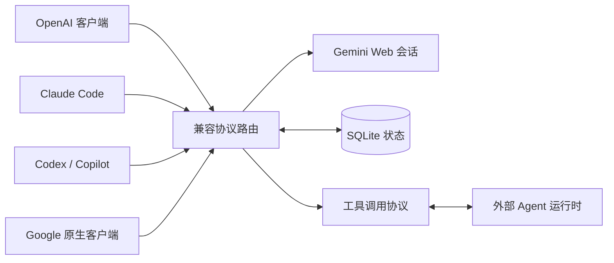

# gemini-web2api-plus

<p align="center">
  <strong>把 Gemini 网页端变成 Codex、Claude Code、Copilot 可用的 Agent 后端。</strong><br>
  一个面向编程 Agent、聊天客户端、SDK 和 Google 原生客户端的非官方兼容网关。
</p>

<p align="center">
  <a href="https://github.com/ksda9001/gemini-web2api-plus/stargazers"></a>
  <a href="https://github.com/ksda9001/gemini-web2api-plus/network/members"></a>
  <a href="https://github.com/ksda9001/gemini-web2api-plus/blob/main/LICENSE"></a>
  
  
</p>

<p align="center"><a href="README.md">English</a></p>

> **重要：** 本项目是 Gemini 网页服务的非官方桥接层，不是 Google 官方 API。它使用浏览器会话或匿名网页访问，因此上游协议、账号权限和频率限制仍由 Google 决定。请只使用你有权使用的账号和流量。

## 项目定位

`gemini-web2api-plus` 不是只能“发送一段文字”的 Gemini Web wrapper，而是一个 **Agent-first Gemini 网关**。它让同一个 Gemini Web 后端同时服务：

- Codex CLI、Claude Code、Copilot 风格编程 Agent
- OpenWebUI、NewAPI、Cherry Studio、ChatBox
- OpenAI Python SDK 和其他 OpenAI 兼容客户端
- Gemini CLI 和 Google 原生 API 客户端

核心能力：

- **Agent 协议接入**：提供 Codex Responses、Claude Messages、Copilot/OpenAI Chat Completions 工具调用接口。
- **多步工具循环**：客户端执行工具，Gemini 继续判断下一步，直到任务完成。
- **会话复用**：Gemini Web conversation metadata 与 SQLite 保存普通聊天和 Agent 状态。
- **长任务稳定性**：SSE 心跳、空响应重试、`BardErrorInfo 1155` 自动续写。
- **轻量部署**：纯 Python、Docker 可用，不需要额外数据库服务或前端。
- **可选登录态**：Cookie、Cookie 刷新、代理、API Key 和持久化数据卷。

## 兼容矩阵

| 客户端或集成 | 接口 | 支持能力 |
| --- | --- | --- |
| OpenWebUI、NewAPI、Cherry Studio、ChatBox | `/v1/chat/completions` | 聊天、SSE 流式、Function Calling |
| Codex CLI | `/v1/responses` | Responses API、工具调用、`previous_response_id`、多步循环 |
| Claude Code | `/v1/messages` | Anthropic Messages、流式工具调用、thinking block |
| Copilot 风格 Agent | `/v1/chat/completions` | OpenAI 兼容工具循环 |
| Gemini CLI、Google 原生客户端 | `/v1beta/models/...` | `generateContent`、`streamGenerateContent`、函数调用 |
| OpenAI Python SDK | `/v1` | Chat Completions 和流式输出 |

本服务是模型网关：它返回工具调用，由接入的 Agent 客户端在自己的真实环境中执行工具。网关不会假装 Gemini 能直接访问客户端的文件系统或终端。

## 请求流程



普通聊天会被转换成紧凑 prompt 发送到 Gemini Web。Agent 请求会携带任务和声明的工具，服务返回客户端协议对应的工具调用，接收外部工具结果后继续同一个 Gemini Web 会话。SQLite 保存客户端历史、工具调用和 Gemini conversation metadata 之间的映射。

## 快速开始

### Docker（推荐）

```bash
git clone https://github.com/ksda9001/gemini-web2api-plus.git
cd gemini-web2api-plus

cp config.example.json config.json
docker build -t gemini-web2api .

docker run -d \
  --name gemini-web2api \
  --restart unless-stopped \
  -p 8081:8081 \
  -v "$PWD/config.json:/app/config.json:ro" \
  -v gemini-web2api-data:/app/data \
  gemini-web2api
```

检查服务：

```bash
curl http://127.0.0.1:8081/
```

`/app/data` 持久化卷用于保存 SQLite 状态和 Cookie 派生缓存。不要把真实 Cookie 或 API Key 写进镜像。

### Python

```bash
git clone https://github.com/ksda9001/gemini-web2api-plus.git
cd gemini-web2api-plus

python -m venv .venv
# Linux/macOS:
source .venv/bin/activate
# Windows PowerShell: .venv\Scripts\Activate.ps1

python -m pip install -U pip
python -m pip install -r requirements.txt
cp config.example.json config.json
python -m gemini_web2api --config config.json
```

默认监听 `http://127.0.0.1:8081`。也可以用命令行临时覆盖端口、代理或 Cookie：

```bash
python -m gemini_web2api --config config.json --port 8081
python -m gemini_web2api --cookie-file ./cookie.json
python -m gemini_web2api --proxy http://127.0.0.1:7890
```

## 第一次请求

当 `api_keys` 为 `[]` 时不校验密钥。配置了一个或多个密钥后，`/v1/*` 请求需要 Bearer Token 或 `x-api-key`。

```bash
curl http://127.0.0.1:8081/v1/chat/completions \
  -H 'Content-Type: application/json' \
  -H 'Authorization: Bearer sk-your-key' \
  -d '{
    "model": "gemini-3.5-flash",
    "messages": [{"role": "user", "content": "Hello from gemini-web2api"}]
  }'
```

OpenAI Python SDK：

```python
from openai import OpenAI

client = OpenAI(
    base_url="http://127.0.0.1:8081/v1",
    api_key="sk-your-key",
)

answer = client.chat.completions.create(
    model="gemini-3.5-flash-thinking",
    messages=[{"role": "user", "content": "请简单解释量子计算。"}],
)
print(answer.choices[0].message.content)
```

## Agent 配置

不同 Agent 使用不同协议。请把客户端指向对应的 Base URL，让客户端继续驱动工具循环。

| 客户端 | Base URL | 协议 |
| --- | --- | --- |
| Codex CLI | `http://127.0.0.1:8081/v1` | OpenAI Responses API |
| Claude Code | `http://127.0.0.1:8081` | Anthropic Messages API |
| Copilot 或其他 OpenAI 兼容 Agent | `http://127.0.0.1:8081/v1` | Chat Completions |

### Codex CLI

```toml
model_provider = "gemini-web2api"
model = "gemini-3.5-flash"

[model_providers.gemini-web2api]
name = "gemini-web2api"
base_url = "http://127.0.0.1:8081/v1"
wire_api = "responses"
env_key = "GEMINI_WEB2API_KEY"
requires_openai_auth = false
```

将 `GEMINI_WEB2API_KEY` 设置为 `api_keys` 中的值；关闭认证时可以使用任意占位值。

### Claude Code

```bash
export ANTHROPIC_BASE_URL=http://127.0.0.1:8081
export ANTHROPIC_AUTH_TOKEN=sk-your-key
export ANTHROPIC_MODEL=gemini-3.5-flash
```

### Copilot 风格客户端

选择 OpenAI 兼容 provider：

```text
Base URL: http://127.0.0.1:8081/v1
Model:    gemini-3.5-flash
API key:  api_keys 中的值；关闭认证时使用占位值
```

不同客户端或扩展使用的环境变量可能不同。

### Agent 多步循环如何工作

1. 首轮工具请求发送任务、行为提示和工具定义。
2. Gemini 通过客户端协议返回工具调用。
3. Codex、Claude Code 或 Copilot 在自己的环境中执行工具并回传结果。
4. SQLite 按工具 call ID 或消息历史，将请求映射到 Gemini Web conversation metadata。
5. 后续轮在会话可恢复时只发送新的用户文本和可信工具结果。

这意味着 Gemini 负责“判断下一步”，接入的 Agent 客户端负责“实际执行”。项目不会把工具结果伪装成普通文本，也不会要求用户手动复制代码来代替工具调用。

这样可以避免每一轮重复发送很大的 Agent prompt。网页会话过期或无法续接时，网关会重建压缩后的历史，并可以回退到旧版 Gemini Web direct transport。

如果 Claude Code 通过 NewAPI 接入，NewAPI 可能会把请求转换成 Google 原生 `streamGenerateContent`。网关会识别转换后系统提示中的 Claude、Codex、Copilot Agent 标记，并保留工具协议完成往返。

## 模型

| 模型名 | 适用场景 | 说明 |
| --- | --- | --- |
| `gemini-3.5-flash` | 日常快速聊天 | 默认通用模型 |
| `gemini-3.5-flash-thinking` | 推理和长任务 | 思考输出最长 |
| `gemini-3.5-flash-thinking-lite` | 自适应推理 | 更低延迟的思考模式 |
| `gemini-3.1-pro` | Pro 路由 | 真正 Pro 路由需要符合条件的账号 Cookie |
| `gemini-3.1-pro-enhanced` | 实验性 Pro 模式 | 额外上游字段 |
| `gemini-auto` | 自动选择 | 交给上游选择 |
| `gemini-flash-lite` | 轻量请求 | 更快的轻量模式 |

在模型名后追加 `@think=N` 调整思考深度：

```text
gemini-3.5-flash-thinking@think=0   # 最深
gemini-3.5-flash-thinking@think=2   # 中等
gemini-3.5-flash-thinking@think=4   # 最浅
```

## Gemini 网页会话与 Cookie

匿名访问适合快速试用。要获得持久 Gemini 历史、真正的 Pro 路由和稳定 Agent 续接，需要登录后的浏览器会话。

支持的 Cookie 格式：

- `name=value` 字符串
- 紧凑 JSON
- Chrome 或 Playwright Cookie 对象数组
- `{"url":"https://gemini.google.com", "cookies":[...]}` 导出格式

浏览器导出至少应包含同一登录会话中的 `__Secure-1PSID` 和 `__Secure-1PSIDTS`。`SID`、`HSID`、`SSID`、`APISID`、`SAPISID` 等伴随 Cookie 也可能有帮助。Cookie 是账号凭据：请放在 Git 外部，只读挂载，并在登录态失效后重新导出。

最小登录态配置：

```json
{
  "api_keys": ["replace-this-key"],
  "cookie_file": "/app/cookie.json",
  "response_store_path": "/app/data/responses.db",
  "reuse_upstream_sessions": true,
  "reuse_upstream_agent_sessions": true,
  "agent_use_webapi": true
}
```

如果 Gemini URL 中包含 `/u/1/` 这样的账号序号，将 `auth_user` 设置为 `"1"`。某些登录会话还需要页面源码中的 `SNlM0e` XSRF 值，将其填入 `xsrf_token`。不要在公开 issue、README、截图或 commit 中粘贴真实 Token。

## 重要配置

从 [`config.example.json`](config.example.json) 开始。常用选项如下：

| 配置 | 作用 | 常见选择 |
| --- | --- | --- |
| `api_keys` | 保护 `/v1/*` | 对网络部署设置强随机密钥 |
| `cookie_file` | 登录态 Gemini Web 会话 | `/app/cookie.json` 或 `null` |
| `response_store_path` | SQLite 历史和 Agent 映射 | Docker 使用 `/app/data/responses.db` |
| `reuse_upstream_sessions` | 复用 Gemini Web 对话 | 有效 Cookie 下设为 `true` |
| `reuse_upstream_agent_sessions` | 保存 Agent 工具调用到 Gemini CID 的映射 | Agent 使用时设为 `true` |
| `agent_use_webapi` | 使用登录态网页会话后端 | 需要持久历史时设为 `true` |
| `google_stream_auto_tools` | 未标记 Google 流式请求是否启用工具 | 普通聊天通常保持 `false` |
| `google_stream_auto_agent_tools` | 保留转换成 Google 请求的 Claude/Codex/Copilot 工具 | `true` |
| `sse_heartbeat_sec` | 防止代理误判长请求断开 | `10` |
| `proxy` | 访问 Google 的 HTTP 代理 | 直连不可用时设置 |

## Docker Compose

如果需要持久化部署，可以使用：

```yaml
services:
  gemini-web2api:
    build: .
    container_name: gemini-web2api
    restart: unless-stopped
    ports:
      - "8081:8081"
    volumes:
      - ./config.json:/app/config.json:ro
      - ./cookie.json:/app/cookie.json:ro
      - gemini-web2api-data:/app/data

volumes:
  gemini-web2api-data:
```

只有使用登录态时才设置 `cookie_file: /app/cookie.json`。不持久化 `/app/data` 时，删除容器会丢失 SQLite 历史和 Cookie 派生缓存。

## Google 原生 API

Gemini CLI 风格客户端可以直接使用 Google 形状的接口：

```bash
export GEMINI_API_KEY=placeholder
export GOOGLE_GEMINI_BASE_URL=http://127.0.0.1:8081
gemini
```

```text
GET  /v1beta/models
POST /v1beta/models/{model}:generateContent
POST /v1beta/models/{model}:streamGenerateContent
```

默认情况下，带有 `functionCallingConfig.mode=AUTO` 的 Google 原生流式请求会按普通文本聊天处理，避免 OpenWebUI/NewAPI 在普通消息中意外携带很大的工具定义。开启 `google_stream_auto_agent_tools` 后，由 Claude Code、Codex、Copilot 转换来的请求会单独识别并保留工具。

## 工具调用

Chat Completions、Responses、Anthropic Messages 和 Google 兼容路由都支持 OpenAI 风格 Function Calling：

```python
from openai import OpenAI

client = OpenAI(base_url="http://127.0.0.1:8081/v1", api_key="sk-your-key")

response = client.chat.completions.create(
    model="gemini-3.5-flash",
    messages=[{"role": "user", "content": "检查当前项目目录。"}],
    tools=[{
        "type": "function",
        "function": {
            "name": "shell_command",
            "description": "在接入的 Agent 环境中运行命令",
            "parameters": {
                "type": "object",
                "properties": {"command": {"type": "string"}},
                "required": ["command"]
            }
        }
    }]
)

print(response.choices[0].message.tool_calls)
```

工具由客户端声明和执行。请不要给 Agent 客户端授予超出预期的文件系统或网络权限。

## 稳定性处理

- SSE 注释心跳，避免 NewAPI、OpenWebUI 和反向代理把正在工作的请求判定为断开。
- 空上游回复自动重试，而不是作为正常空 `STOP` 返回。
- 检测到 `BardErrorInfo 1155` 输出上限时自动续写。
- 对过长工具输出和旧历史进行确定性压缩。
- 登录态网页会话续接失败时，用压缩历史重建，并可回退到旧版 direct transport。
- 识别 Cookie 过期时间，自动忽略短期的 `__Secure-1PSIDRTS` 等失效条目。

这些机制只能提高恢复能力，不能保证 Google 的非官方网页协议永远稳定。

## 故障排查

### 服务启动但回复为空或被截断

1. 检查 `curl http://127.0.0.1:8081/` 和容器日志。
2. 确认服务器可以访问 `gemini.google.com`。
3. 直连受阻时配置 `proxy` 或 `HTTPS_PROXY`。
4. Docker bridge/NAT 地址被上游拒绝时尝试 host network。
5. 登录态失效时重新导出 Cookie，并确认 `/app/data` 已持久化。

### Agent 输出代码并让我手动复制

确认客户端使用了带工具能力的接口：Codex 使用 `/v1/responses`，Claude Code 使用 `/v1/messages`，Copilot 风格客户端使用 `/v1/chat/completions`。请求必须真正携带声明的工具。如果 NewAPI 将请求转换成 Google 原生格式，保持 `google_stream_auto_agent_tools` 开启。

### Agent 没有继续历史

将 `reuse_upstream_sessions`、`reuse_upstream_agent_sessions` 和 `agent_use_webapi` 设置为 `true`，使用有效浏览器会话并持久化 `/app/data`。SQLite 保存的是桥接状态，不是替代调用客户端自己的完整聊天历史。

### 登录失败

确认 Cookie 来自同一个浏览器会话，账号序号与 `/u/<index>/` 匹配，并且 Cookie 挂载路径和 `cookie_file` 一致。不要把 Cookie 或 XSRF Token 放进 Git。

## 限制

- 依赖非官方 Gemini 网页协议，Google 修改前端或风控后可能失效。
- Google 账号 Cookie 是敏感凭据，可能过期或被撤销。
- 真正的 Pro 路由需要符合条件的 Gemini Advanced 账号；Cookie 本身不会把免费账号升级成 Pro。
- Gemini、账号、网络和反向代理的频率限制仍然有效。
- Agent 工具运行在外部客户端环境，不运行在本 API 容器内部。
- 图片输入通过登录态上传路径支持，但多模态行为依赖上游网页会话，稳定性可能低于文本请求。
- 本项目是兼容网关，不是官方 Google API，也不保证无限制访问。

## 开发与测试

```bash
python -m unittest discover -s tests -q
python3 -m py_compile gemini_web2api/*.py tests/test_agent_compat.py
git diff --check
```

测试覆盖 OpenAI Chat Completions、Responses、Anthropic Messages、Google 原生请求、流式输出、工具修复、SQLite 持久化、Cookie 解析和网页会话回退。

## 致谢

- [HanaokaYuzu/Gemini-API](https://github.com/HanaokaYuzu/Gemini-API)：动态 Gemini 网页会话客户端
- [Nativu5/Gemini-FastAPI](https://github.com/Nativu5/Gemini-FastAPI)：持久会话匹配思路
- 开源 Gemini Web 兼容项目生态

## License

[MIT](LICENSE)

如果这个项目帮你省下了时间，欢迎点一个 star。提交问题时，最好附上可复现的请求、脱敏日志和运行环境，方便其他人一起定位。
